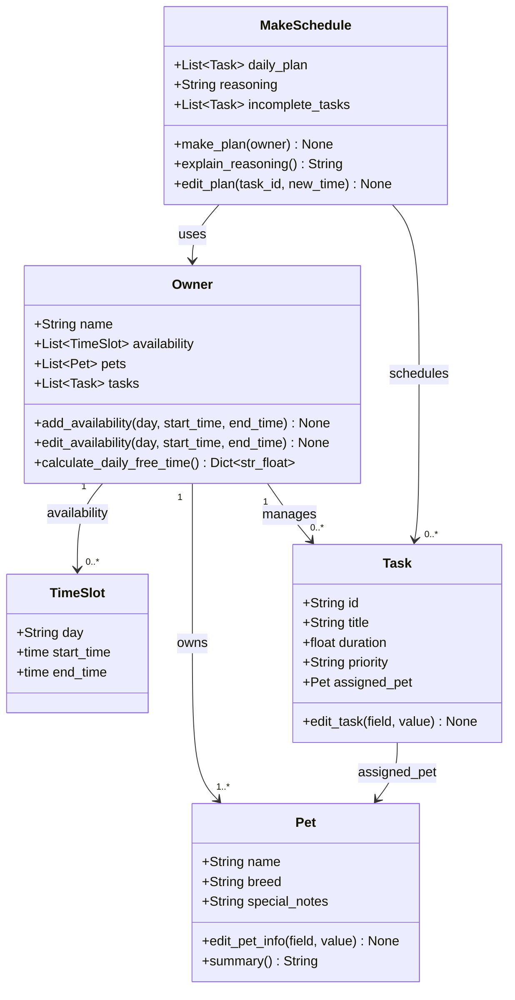

```mermaid
classDiagram
    class TimeSlot {
        +String day
        +time start_time
        +time end_time
    }

    class Pet {
        +String name
        +String breed
        +String special_notes
        +edit_pet_info(field, value) None
        +summary() String
    }

    class Task {
        +String id
        +String title
        +float duration
        +String priority
        +Pet assigned_pet
        +edit_task(field, value) None
    }

    class Owner {
        +String name
        +List~TimeSlot~ availability
        +List~Pet~ pets
        +List~Task~ tasks
        +add_availability(day, start_time, end_time) None
        +edit_availability(day, start_time, end_time) None
        +calculate_daily_free_time() Dict~str_float~
    }

    class MakeSchedule {
        +List~Task~ daily_plan
        +String reasoning
        +List~Task~ incomplete_tasks
        +make_plan(owner) None
        +explain_reasoning() String
        +edit_plan(task_id, new_time) None
    }

    Owner "1" --> "1..*" Pet : owns
    Owner "1" --> "0..*" Task : manages
    Owner "1" --> "0..*" TimeSlot : availability
    Task --> Pet : assigned_pet
    MakeSchedule --> Owner : uses
    MakeSchedule --> "0..*" Task : schedules
```
