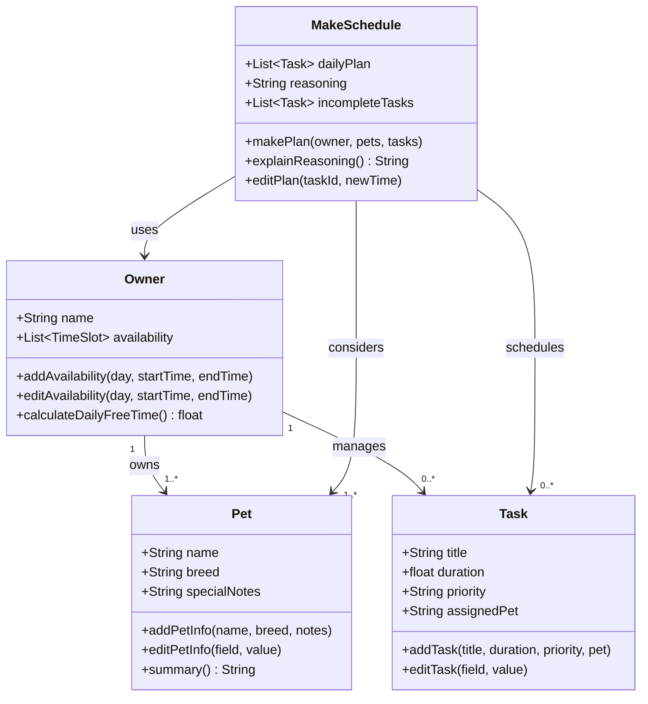

```mermaid
classDiagram
    class Owner {
        +String name
        +List~TimeSlot~ availability
        +addAvailability(day, startTime, endTime)
        +editAvailability(day, startTime, endTime)
        +calculateDailyFreeTime() float
    }

    class Pet {
        +String name
        +String breed
        +String specialNotes
        +addPetInfo(name, breed, notes)
        +editPetInfo(field, value)
        +summary() String
    }

    class Task {
        +String title
        +float duration
        +String priority
        +String assignedPet
        +addTask(title, duration, priority, pet)
        +editTask(field, value)
    }

    class MakeSchedule {
        +List~Task~ dailyPlan
        +String reasoning
        +List~Task~ incompleteTasks
        +makePlan(owner, pets, tasks)
        +explainReasoning() String
        +editPlan(taskId, newTime)
    }

    Owner "1" --> "1..*" Pet : owns
    Owner "1" --> "0..*" Task : manages
    MakeSchedule --> Owner : uses
    MakeSchedule --> "1..*" Pet : considers
    MakeSchedule --> "0..*" Task : schedules
```
